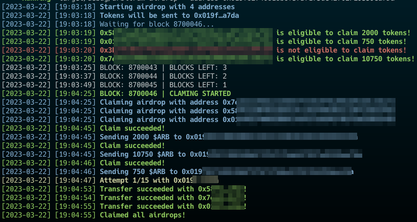

## Arbitrum airdrop claimer bot

This bot will claim your airdrop tokens from the [Token Distributor contract](https://arbiscan.io/address/0x67a24ce4321ab3af51c2d0a4801c3e111d88c9d9). If you have multiple eligible addresses, a mode is available to send all your tokens to a single address.

### Requirements
- [Rust and Cargo](https://doc.rust-lang.org/cargo/getting-started/installation.html)

### Setup
1. Put your private keys in the file `json/addresses.json`
2. Copy `.env.example`, name it `.env` and fill in the `NETWORK_RPC` and `NETWORK_WSS` values. You can get your own RPC and WSS endpoints from [Alchemy](https://auth.alchemy.com/).
   You have to create **two projects**, one on the **Ethereum mainnet** and one on the **Arbitrum mainnet**. `NETWORK_RPC` should be the Ethereum mainnet RPC endpoint and `NETWORK_WSS` should be the Arbitrum mainnet WSS endpoint.

It's recommended to run the bot as late as possible to avoid the risk to see your requests limited by Alchemy.

### Usage
If you want to send your tokens to an other address, run :
```bash
cargo run -- --address 0xYOURADRESS
```

else
```bash
cargo run
```

You should see something like this :



A limit of 15 transfer attempts is set to avoid infinite loops. 

### Disclaimer
This bot is provided as is, without any warranty. Use it at your own risk.
I advise you to try to manually claim it too, just to be sure.